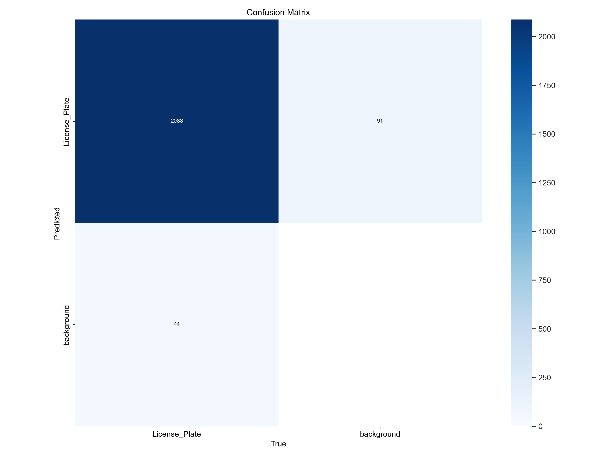
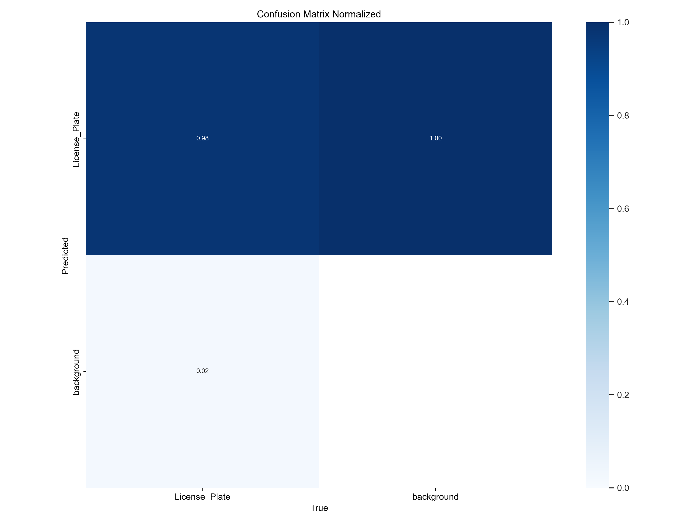
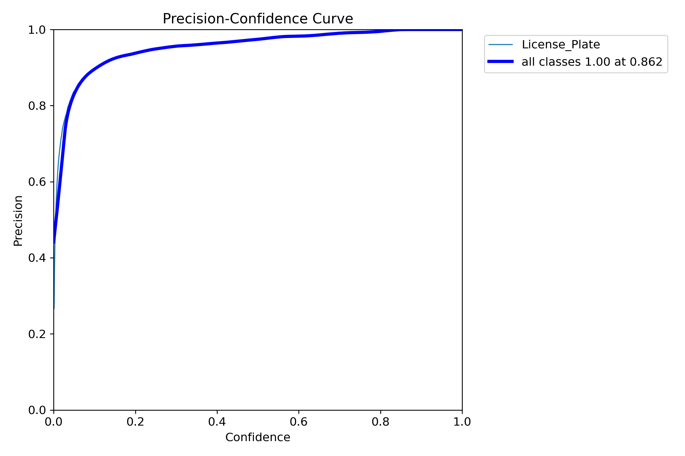
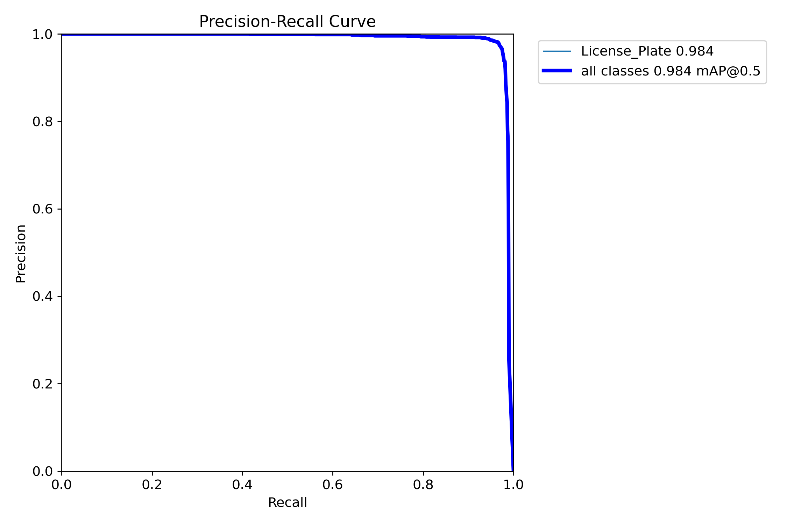
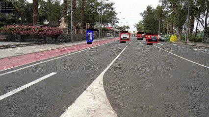
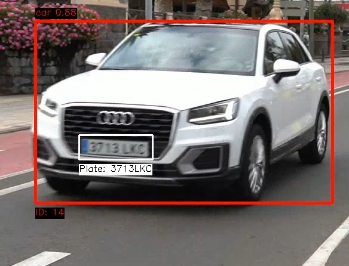

# Práctica 4. Reconocimiento de matrículas

Este repositorio contiene la **Práctica 4** donde se utilizan técnicas de procesamiento de video para la detección y seguimiento de vehículos y personas, aplicando reconocimiento de caracteres a las matrículas visibles. Para ello, hacemos uso de modelos YOLO para detectar objetos y OCRs para el reconocimiento de texto.

## Índice

- [Práctica 4. Reconocimiento de matrículas](#práctica-4-reconocimiento-de-matrículas)
  - [Índice](#índice)
  - [Librerías utilizadas](#librerías-utilizadas)
  - [Autores](#autores)
  - [Tarea](#tarea)
    - [Reentramiento del Modelo YOLO con Ultraytics](#reentramiento-del-modelo-yolo-con-ultraytics)
      - [Graficas Del Reentreamiento](#graficas-del-reentreamiento)
    - [Configuración Inicial y Parámetros](#configuración-inicial-y-parámetros)
      - [Rutas de Video y Modelos](#rutas-de-video-y-modelos)
      - [Configuración de Salida](#configuración-de-salida)
      - [Inicialización de Modelos](#inicialización-de-modelos)
      - [Configuración de Real-ESRGAN](#configuración-de-real-esrgan)
      - [Configuración de Entrada y Salida de Video](#configuración-de-entrada-y-salida-de-video)
      - [Algoritmo Principal de Detección y Seguimiento](#algoritmo-principal-de-detección-y-seguimiento)
      - [Bucle de Fotogramas](#bucle-de-fotogramas)
      - [Procesamiento de Detecciones](#procesamiento-de-detecciones)
      - [Detección y Reconocimiento de Matrículas](#detección-y-reconocimiento-de-matrículas)
      - [Guardar Resultados y Liberación de Recursos](#guardar-resultados-y-liberación-de-recursos)
    - [Extra: Como instalar Real-ESRGAN](#extra-como-instalar-real-esrgan)
      - [Corrección de Error Conocido](#corrección-de-error-conocido)
    - [Resultados](#resultados)
    - [Extra: Funcionalidades de Anonimización](#extra-funcionalidades-de-anonimización)
  - [Referencias y bibliografía](#referencias-y-bibliografía)

## Librerías utilizadas

[](https://ultralytics.com/yolo)
[](https://pytorch.org/)
[](https://github.com/tesseract-ocr/tesseract)
[](https://github.com/JaidedAI/EasyOCR)
[](https://opencv.org/)
[](https://developer.nvidia.com/cuda-toolkit)
[](https://github.com/xinntao/Real-ESRGAN)
[](https://github.com/xinntao/Real-ESRGAN)


## Autores

Este proyecto fue desarrollado por:

- [](https://github.com/gitfrandu4)
- [](https://github.com/DerKom)


## Tarea

### Reentramiento del Modelo YOLO con Ultraytics
El siguiente script configura y entrena un modelo YOLO usando un archivo `.yaml` para definir las rutas de los datos y las clases:

```python
from ultralytics import YOLO

# Ruta al archivo de configuración .yaml que especifica las rutas de los datos y las clases
yaml_path = "datasets/data.yaml"

# Ruta del modelo YOLO preentrenado que se usará como base
base_model = "yolo11n.pt"  # Asegúrate de usar la versión correcta del modelo

# Configuración de hiperparámetros para el entrenamiento
img_size = 640          # Tamaño de las imágenes
batch_size = 16         # Ajusta según la memoria de tu GPU
epochs = 100            # Número de épocas
device = "cuda:0"       # Especifica la GPU

def train_yolo():
    model = YOLO(base_model)
    
    model.train(
        data=yaml_path,
        imgsz=img_size,
        batch=batch_size,
        epochs=epochs,
        device=device,
        workers=4,                 # Número de trabajadores para la carga de datos
        augment=True,              # Habilita el aumento de datos
        verbose=True,              # Muestra información detallada durante el entrenamiento
        # learning_rate=0.01,      # Puedes especificar una tasa de aprendizaje personalizada
        # weight_decay=0.0005,     # Agrega regularización si es necesario
    )

if __name__ == "__main__":
    train_yolo()
```

#### Graficas Del Reentreamiento

<table style="width: 100%; text-align: center;">
  <tr>
    <td style="text-align: center; padding-right: 20px;">
      
      <p>Esta es la matriz de confusión que muestra cómo el modelo predice cada clase. Aquí vemos que el modelo identificó correctamente 2088 casos de “License Plate” y solo confundió 91 con la clase “background”. Esto sugiere que el modelo tiene un buen desempeño en general, con pocos errores al identificar placas, aunque aún podría mejorar en la reducción de falsos positivos.</p>
    </td>
    <td style="text-align: center;">
      
      <p>En esta matriz de confusión normalizada, se representa la precisión relativa para cada clase, o sea, se normalizan los valores para ver la proporción de aciertos en lugar de los números absolutos. Notamos que el modelo tiene un 98% de precisión para detectar “License Plate” y un 100% para el “background”. Esto indica que, aunque el modelo es muy preciso en general, aún confunde algunos casos.</p>
    </td>
  </tr>
  <tr>
    <td style="text-align: center; padding-right: 20px;">
      
      <p>La curva de F1 en función de la confianza muestra cómo varía la F1 (una métrica que combina precisión y recall) dependiendo del umbral de confianza. Podemos ver que el modelo alcanza su mejor valor de F1 (cerca de 0.97) para niveles de confianza alrededor de 0.5. Esto significa que a ese nivel de confianza, el modelo logra un buen balance entre la precisión y el recall.</p>
    </td>
    <td style="text-align: center;">
      
      <p>Esta gráfica muestra la distribución de etiquetas. Vemos que la mayoría de los datos pertenecen a la clase “License Plate”. Esto puede ser útil para entender el sesgo en el dataset y también nos ayuda a identificar si el modelo podría tener más dificultad en detectar “background” debido a la menor cantidad de ejemplos de esa clase.</p>
    </td>
  </tr>
  <tr>
    <td style="text-align: center; padding-right: 20px;">
      
      <p>El correlograma de etiquetas muestra cómo se relacionan entre sí algunas propiedades de las etiquetas, como “x”, “y”, “width” y “height”. Notamos que hay una correlación entre “width” y “height”, lo que sugiere que las placas de matrícula tienden a tener proporciones similares. Esto puede ser útil para el modelo en la detección de patrones consistentes en las dimensiones de las placas.</p>
    </td>
    <td style="text-align: center;">
      
      <p>Esta es la curva de precisión en función de la confianza, que muestra qué tan seguro está el modelo de sus predicciones. Aquí se observa que cuando el nivel de confianza es alto (por encima de 0.8), la precisión es casi perfecta (cercana al 100%). Esto significa que el modelo es muy preciso en sus predicciones cuando está bastante seguro, lo cual es un buen indicador de rendimiento.</p>
    </td>
  </tr>
  <tr>
    <td style="text-align: center; padding-right: 20px;">
      
      <p>La curva de precisión-recall es útil para ver cómo el modelo maneja el balance entre estos dos aspectos. Aquí se muestra que el modelo mantiene altos valores tanto de precisión como de recall en la mayoría de los puntos. Esto significa que el modelo no solo es bueno para hacer predicciones correctas, sino también para captar la mayoría de los ejemplos de interés.</p>
    </td>
    <td style="text-align: center;">
      
      <p>La curva de recall en función de la confianza nos muestra cómo el modelo identifica todos los casos relevantes a diferentes niveles de confianza. Vemos que el recall es muy alto (alrededor del 99%) para valores de confianza menores a 0.8, lo que indica que el modelo logra detectar la mayoría de los ejemplos de placa incluso con una confianza moderada.</p>
    </td>
  </tr>
  <tr>
    <td style="text-align: center; padding-right: 20px;">
      
      <p>Estas gráficas muestran la pérdida y las métricas de precisión y recall durante el entrenamiento y validación. Se observa una disminución continua en las pérdidas, lo que significa que el modelo aprende bien. Además, el aumento de la precisión y el recall indican que el modelo mejora su capacidad predictiva con cada iteración.</p>
    </td>
  </tr>
</table>

### Configuración Inicial y Parámetros

#### Rutas de Video y Modelos
El script comienza definiendo las rutas para:
- `video_path`: La ruta del video de entrada que se va a procesar.
- `model_path`: Modelo YOLO para la detección general de objetos.
- `license_plate_detector_model_path`: Modelo YOLO específico para la detección de matrículas.

```python
video_path = 'C0142.mp4'
model_path = 'yolo11n.pt'
license_plate_detector_model_path = 'runs2/detect/train9/weights/best.pt'
```

#### Configuración de Salida
Define rutas y configuraciones de salida para el video y el archivo CSV, incluyendo las clases a detectar:
```python
output_video_path = 'output_video.mp4'
csv_file_path = 'detection_tracking_log.csv'
show_video = True
classes_to_detect = [0, 1, 2, 3, 5]
```

#### Inicialización de Modelos
Se inicializan los modelos YOLO y el detector de matrículas, además de un lector OCR (`easyocr`) para la extracción de texto de matrículas.
```python
model = YOLO(model_path)
license_plate_detector = YOLO(license_plate_detector_model_path)
reader = easyocr.Reader(['en'], gpu=True)
```

#### Configuración de Real-ESRGAN
Real-ESRGAN mejora la calidad de imagen de las matrículas antes del OCR.
```python
model_esrgan = RRDBNet(num_in_ch=3, num_out_ch=3, num_feat=64, num_block=6, num_grow_ch=32, scale=4)
model_path_esrgan = 'RealESRGAN_x4plus_anime_6B.pth'
upsampler = RealESRGANer(scale=4, model_path=model_path_esrgan, model=model_esrgan, ...)
```

---

#### Configuración de Entrada y Salida de Video

El código prepara el video para su captura utilizando `cv2.VideoCapture` y configura el video de salida.
```python
cap = cv2.VideoCapture(video_path)
fourcc = cv2.VideoWriter_fourcc(*'mp4v')
fps = cap.get(cv2.CAP_PROP_FPS)
frame_width = int(cap.get(cv2.CAP_PROP_FRAME_WIDTH))
frame_height = int(cap.get(cv2.CAP_PROP_FRAME_HEIGHT))
out = cv2.VideoWriter(output_video_path, fourcc, fps, (frame_width, frame_height))
```

---

#### Algoritmo Principal de Detección y Seguimiento

#### Bucle de Fotogramas
El código entra en un bucle que procesa cada fotograma del video e incrementa el contador de fotogramas:
```python
ret, frame = cap.read()
frame_number += 1
```

#### Procesamiento de Detecciones
YOLO detecta objetos en el fotograma según `classes_to_detect`. Para cada objeto detectado:
1. **Extracción de Coordenadas y Clase**: Obtiene la caja delimitadora y la confianza del objeto.
2. **Seguimiento de ID Único**: Cuenta e identifica objetos únicos usando `track_id`.
3. **Almacenamiento de Datos del Objeto**: Guarda datos como clase, confianza y detalles del fotograma en `object_info`.
4. **Anotación**: Dibuja cajas alrededor de cada objeto detectado y añade etiquetas de clase y confianza.

```python
results = model.track(frame, persist=True, classes=classes_to_detect)
```

---

#### Detección y Reconocimiento de Matrículas

Para cada vehículo detectado (auto, motocicleta, autobús):
1. **Región de Interés (ROI) del Vehículo**: Recorta la región del vehículo detectado en el fotograma.
2. **Detección de Matrículas**: Ejecuta el modelo YOLO de matrículas en la región recortada.
3. **Mejora de Imagen con Real-ESRGAN**: Mejora la calidad de la imagen de la matrícula.
4. **Extracción de Texto con OCR**: Extrae el texto de la matrícula con `easyocr`, guardando el texto con mayor confianza en `object_info`.
5. **Anotaciones**: Dibuja cajas alrededor de las matrículas y muestra el texto en el fotograma.

```python
vehicle_img = frame[y1:y2, x1:x2]
plate_results = license_plate_detector.predict(vehicle_img)
output, _ = upsampler.enhance(np.array(license_plate_roi), outscale=4)
plate_ocr_results = reader.readtext(enhanced_license_plate, allowlist='0123456789ABCDEFGHIJKLMNOPQRSTUVWXYZ')
```

---

#### Guardar Resultados y Liberación de Recursos

Después de procesar todos los fotogramas, la información de detección de objetos se guarda en un archivo CSV, y se liberan los recursos para evitar problemas de memoria.

```python
with open(csv_file_path, mode='w', newline='') as file:
    writer = csv.writer(file)
    writer.writerow([...])
    for track_id, info in object_info.items():
        writer.writerow([...])
cap.release()
out.release()
cv2.destroyAllWindows()
```

### Extra: Como instalar Real-ESRGAN

1. Primero, navega a la carpeta de tu proyecto y ejecuta los siguientes comandos:

   ```bash
   # Instalar Git (si no lo tienes ya instalado)
   conda install git

   # Clonar el repositorio de Real-ESRGAN
   git clone https://github.com/xinntao/Real-ESRGAN

   # Navegar dentro del directorio del proyecto
   cd Real-ESRGAN

   # Instalar dependencias
   pip install basicsr
   pip install facexlib
   pip install gfpgan
   pip install -r requirements.txt

   # Configurar el entorno de desarrollo
   python setup.py develop
   ```

2. Descargar el modelo preentrenado:
   
   Descarga el archivo del modelo desde el siguiente enlace y colócalo en la carpeta raíz del proyecto:  
   - [RealESRGAN_x4plus.pth](https://github.com/xinntao/Real-ESRGAN/releases/download/v0.1.0/RealESRGAN_x4plus.pth)
   - [RealESRGAN_x4plus_anime_6B.pth](https://github.com/xinntao/Real-ESRGAN/releases/download/v0.2.2.4/RealESRGAN_x4plus_anime_6B.pth)

#### Corrección de Error Conocido

Para resolver un error que puede ocurrir, edita el archivo `degradations.py` en tu entorno.

1. Localiza el archivo en:
   ```plaintext
   C:\Users\<tu_usuario>\anaconda3\envs\VC_P4\Lib\site-packages\basicsr\data\degradations.py
   ```

2. Busca la línea:

   ```python
   from torchvision.transforms.functional_tensor import rgb_to_grayscale
   ```

3. Reemplázala por:

   ```python
   from torchvision.transforms.functional import rgb_to_grayscale
   ```
   
Esto debería corregir el problema y completar el proceso de instalación.

### Resultados

<table>
  <tr>
    <td style="text-align: center; padding-right: 20px;">
      
    </td>
    <td style="text-align: center;">
      
    </td>
  </tr>
</table>

### Extra: Funcionalidades de Anonimización

Este proyecto incluye funcionalidades avanzadas para la anonimización de personas y matrículas en el video. A continuación se detalla cada una:

- **Anonimización de Personas**: Detecta y aplica un efecto de desenfoque a las personas en el video.
- **Anonimización de Matrículas**: Para vehículos identificados, se aplica desenfoque sobre las matrículas visibles.
- **Control de Anonimización con la tecla "B"**: La tecla "B" habilita o deshabilita el efecto de desenfoque de manera dinámica durante el procesamiento del video. Esto permite al usuario decidir, en tiempo real, si se quiere aplicar el efecto de anonimización.

## Referencias y bibliografía

- YOLO Documentation: [ultralytics.com/yolo](https://docs.ultralytics.com/)
- PyTorch Documentation: [pytorch.org](https://pytorch.org/docs/)
- Tesseract Documentation: [github.com/tesseract-ocr](https://github.com/tesseract-ocr/tesseract)
- EasyOCR Documentation: [github.com/JaidedAI/EasyOCR](https://github.com/JaidedAI/EasyOCR)
- OpenCV Documentation: [docs.opencv.org](https://docs.opencv.org/)
- CUDA Documentation: [developer.nvidia.com/cuda-toolkit](https://developer.nvidia.com/cuda-toolkit)
- Real-ESRGAN Documentation: [Real-ESRGAN Documentation](https://github.com/xinntao/Real-ESRGAN)
- RRDBNet Documentation: [RRDBNet Documentation](https://github.com/xinntao/Real-ESRGAN)
